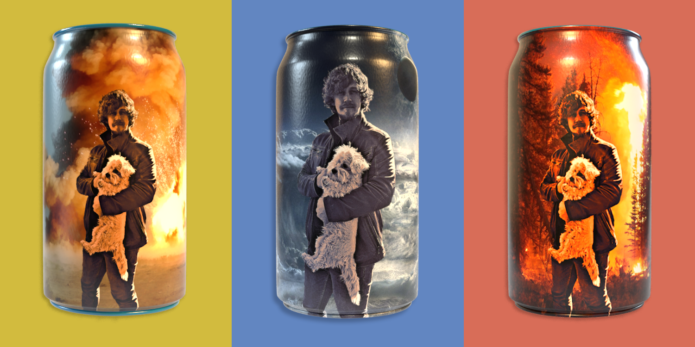

### Hi there! Welcome to my GitHub!

Being incredibly handsome is not enough to be be a successful member of our society these days. Therefore I decided that it is time to learn some useful skills. For quite some time now I have been learning the myterious arts of web design and development. I'm starting to feel that I'm getting pretty good at it. Even though I haven't realized any big projects yet, I trust myself with more and more difficult tasks.

I use my GitHub account to track my progression and to share what I'm working on with others ... for now. In the future I want to shine with my own fantastic creations and realize my own ideas. Until I am ready, I will learn from others and refine my skills repertoire.

***

These are technologies I can confidently work with:

***

These are the technologies I have already tried out:  

... and more.

***

These are the technologies I still want to learn or deepen:  

... and more.
